# I. Definition
## Project Overview

The digital transformation has completely changed our way of communicating between ourselves. Today most of our social relationships, work, and reading is done online. Although, online communication has been a great place for personal expression and insightful discussions, it has also been a place for toxic and divisive content. The threat of abuse and online harassment, which derives from this toxic content, has been a growing concern this past few years [1]. People who suffer from this divisive content usually stop expressing themselves and give up on seeking different opinions. On the long run, this can become an existential problem in freedom of speech. 

Many well-known social and news media platforms have tackled this issue with online moderators, however, the immense amount of content that every day is generated makes this task extremely hard and most of the time futile. Hence, many platforms have turn to machine learning to identify, evaluate and support online moderators on this critical task. This has become a reality for big media platforms such as The Economist [2], Wikipedia [3], New York Times [4], and The Guardian [5]. All of them have partnered with Google and Jigsaw to experiment with their new Perspective API that helps them host better online conversations [6]. 

This task is part of a subfield called Natural Language Processing (NLP), which is concerned with the interactions between computers and human languages, in particular how to program computers to process and analyze large amounts of natural language data [7]. This field has greatly grown these past few years and I hope that with this proyect I get introduce myself to this new subject, learn and in the long run contribute. 

## Problem Statement

Quora is a platform that empowers people to learn from each other, thus it’s been a frequent target for abusive content. Quora wants to keep their platform as a place where users can feel safe sharing their knowledge with the world, therefore it wants to face this problem by hosting a Kaggle competition aimed at **identifying** and **flagging** insincere questions [8].  By definition an insincere question is a question which is founded upon false premises, or that intend to make a statement rather than look for helpful answers. Quora wants kagglers to develop **scalable methods and models** that will help achieve this goal.

## Metrics

As we will se in the exploratory section of this report, our data set is very unbalanced. Therefore, and as recommended in the kaggle competition, I will use de F1-score for model performance. This metrics considers both precision and recall, thus is very helpful in this case because we are dealing with an unbalanced dataset. The formula used to obtain this metric is:

$$\frac{2*precision*recall}{precision+recall}$$

For univariate feature evaluation I will look into **chi-squared statistic** between each non-negative feature and class. Chi-square test measures dependence between stochastic variables, so using this function it filters out features that are the most likely to be independent of class and therefore irrelevant for classification [9]. In case negative features emerge (metafeature extraction por example), I will use a information gain feature evaluation like **Mutual information** implementation of scikit learn. Mutual information (MI) between two random variables is a non-negative value, which measures the dependency between the variables. It is equal to zero if and only if two random variables are independent, and higher values mean higher dependency [10].

# II. Analysis
## Exploratory and Visual Data Analysis

In this section I will go in deep in understanding the data, showing basic statistics and visualizations. First, lets see a sample of the data in **Figure 1**.

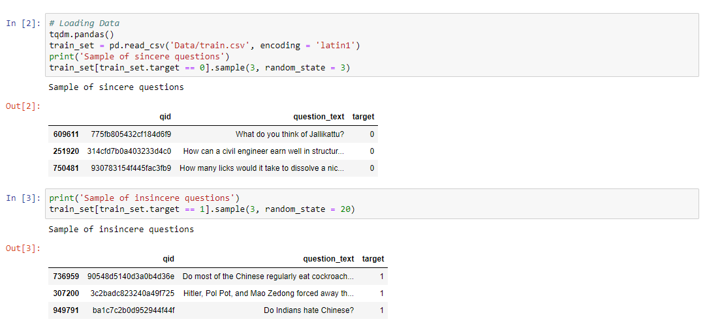

The dataset considered for this project can be found and downloaded from the competition site [11]. **The data set has a total of 1048575 rows and 3 columns**. The description of each column is as folliwing:

- qid: unique question identifier
- question_text: Quora question text
- target: a question labeled "insincere" has a value of 1, otherwise 0

The criteria’s to define an insincere question was based on the following characteristics:

* Has a non-neutral tone: exaggerated tone or rhetorical tone meant to make a statement about a group of people.
* Is disparaging or inflammatory: making discriminatory and/or harsh comments, or based on outlandish premise about a group of people.
* Isn't grounded in reality: based of false information or absurd assumptions. 
* Uses sexual content for shock value, and not to seek genuine answers

As expected from this type of labeling, the ground-truth are not guaranteed to be perfect but suficient for the problem.

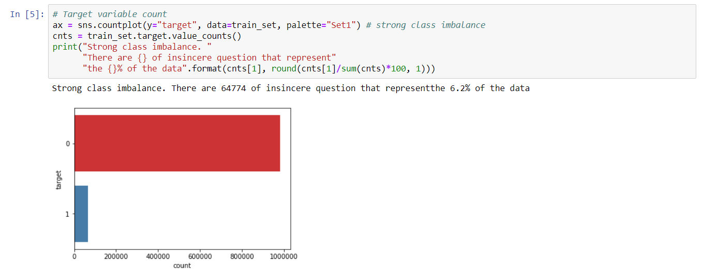

As plotted on **Figure 2** the data set is very unbalance. Therefore, I will take measures to reduce this problem during modelling (many models include a `class_weight = 'balanced` parameter to assign more weight to the lower class), and splitting data (`stratify` parameter).

### Word Level Exploration

A first approach to understand the problem at hand is to visualize the questions and calculate basic frequency statistics of words. 

As you can see in **Figure 3** and tables above, its very dificult to extract a pattern between target classes. The main reason is because each document is clouded by **noise and common words that we call stopwords**. So one important step will be eliminating this noise words and standarise each word to the same forma

### Document level exploration

I will now create 3 basic meta document features to find macro structures and **outliers**. These will be the `char_count_full`, `word_count_full`, and `word_density_full`. These features can give us an idea of the overall structure of the questions.

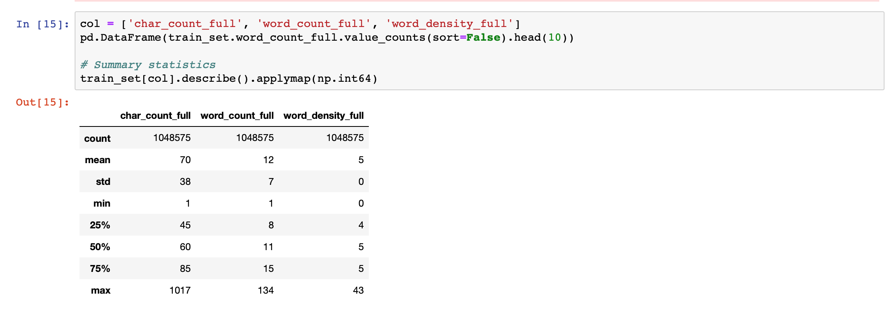

On average a question consist of **12 words, around 70 character** (**Figure 4**). The amount of characters per word (word density) is around 5. However, its ver easy to see that there are extremes. On the lower bound, we have questions that have 1 word, or 1 character or in the upper bound questions of 134 words or a word density of 43 characters per word, which is extremely rare. They are non-sense question, for example in **Figure 5**:

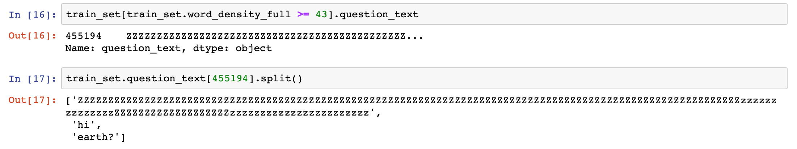

Upper bound extremes are easier to see in a histogram (**Figure 6**):

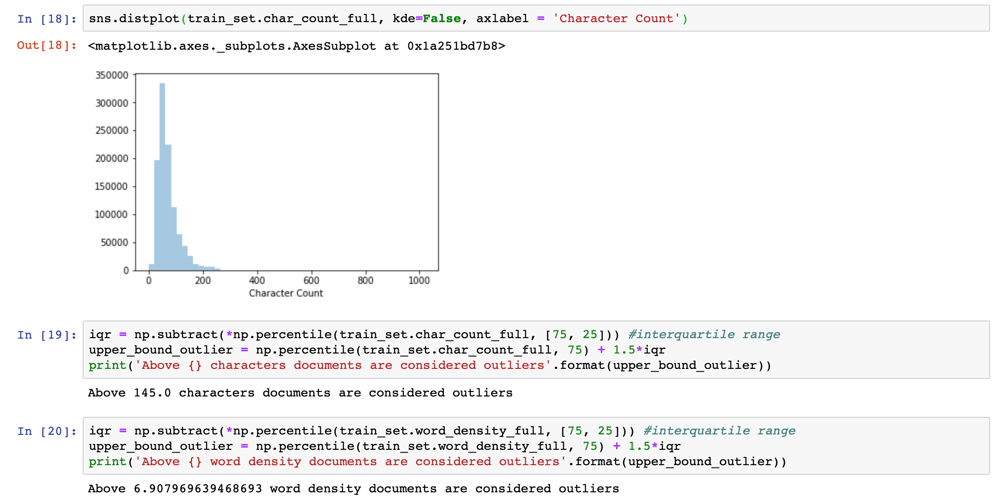

The histogram is righ skewed showing that there are big outliers in terms of document lenght. Above 145 characters, documents are considered outliers of this data. Lets look at the same statistic by target in **Figura 7**:

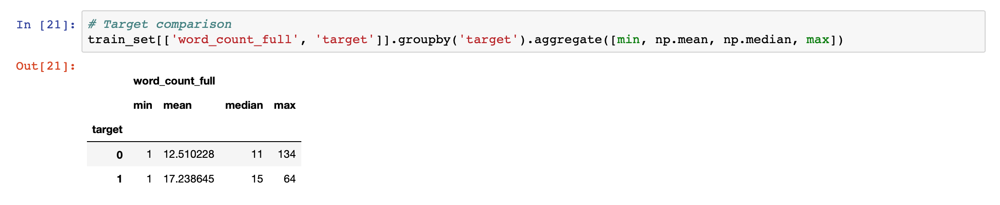

It seems that insincere questions tend to be more **elaborate than sincere**. On average there are **17 words** per insincere questions instead of **13 words** per sincere question. Now lets see if there are different distribution of the target in the outlier questions in **Figure 8**:

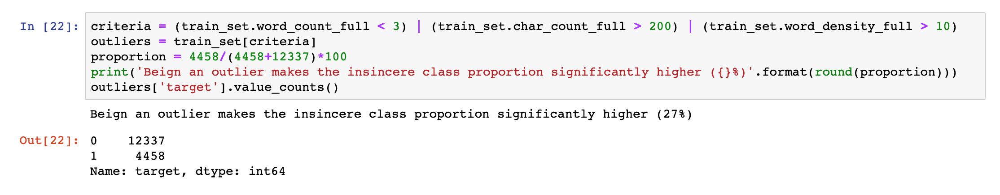

After testing multiple cut-off point for outliers, the `word_count` < 3, `char_count`> 200, and `word_density`>10 maximizes the insincere class. This criteria will be use to create an outlier feature and help the model with these types of questions. This will specially useful when looking into these documents after processing, its most likely that many will end up in zero words because of stopwords removal. 

## Algorithms and Techniques

The main algorithms are separated into two main groups:

### Feature extraction algorithms

+ **Bag of Words Model**: all text feature extraction will be done using this model. is represented as the bag (multiset) of its words, disregarding grammar and even word order but keeping multiplicity. However, although is a very simplistic representation, it has shown to be very usefull in a wide variety of natural language processing tasks. Python has two powerful NLP modules that implement this model, the `NLTK` and `gensim` modules. Both are going to be use for feature extraction. 

+ **TF-IDF statistic**: TF-IDF score represents the relative importance of a term in the document and the entire corpus. TF-IDF score is composed by two terms: the first computes the normalized Term Frequency (TF), the second term is the Inverse Document Frequency (IDF), computed as the logarithm of the number of the documents in the corpus divided by the number of documents where the specific term appears [12]. This statistic normalization will be apply to all the text feature analysis. 

### Classification algorithms and techniques
    
This is a binary classification task. Hence, the models that will be tested with pros and cons are:

+ **Linear Models**: The main algorithm will be the logistic classifier implemented as `LogisticRegression()` in sci-kit learn. this algorithm is usually the *go-to* benchmark. Its usually very fast and scales excellent with data. If the data preprocessing is adequate, the performance is usual very decent. However, since its linear, it fails to grasp non-linearities in the data and many times underperforming in complex datasets. Also it suffers from multicollinearity. 
    
+ **Naive Bayes**: Is a family of simple "probabilistic classifiers" based on applying Bayes' theorem with strong (naive) independence assumptions between the features. Naive Bayes classifiers are highly scalable, requiring a number of parameters linear in the number of variables (features/predictors) in a learning problem. Nevertheless, as with linear models, naive bayes suffers to grasp non-linearities in the data. Despite their naive design and apparently oversimplified assumptions, naive Bayes classifiers have worked quite well in many complex real-world situations, particularly in NLP tasks. For this project I will implement the `ComplementNB()`, this variant was designed to correct the “severe assumptions” made by the standard Multinomial Naive Bayes classifier. It is particularly suited for imbalanced data sets.

+ **LightGBM**: Is one of the most recent and most powerful gradient boosting machines. Microsoft developed this algorithm in 2017 and has rapidly found its way to top kaggle competitions. Gradient boosting in general suffers from eficiency and scalabity when the feature dimension is high and data size is large. LightGBM is able to train significantly faster, with low memory usage, and higher accuracy [14]. This classifier is perfect for our task due to the vast amount of text features that will be generated during the feature extraction phase. As with other gradient boosting algorithms LightGBM adapts to data learning from its mistakes and is generally tolerant to overfitting. Although is not native to Sci-kit learn, the authors have made it compatible. The classifiers is name:  `LGBMClassifier()`.

+ **Ensemble**: I will also test an ensemble scheme. The goal of ensemble methods is to combine the predictions of several base estimators built with a given learning algorithm in order to improve generalizability / robustness over a single estimator. The best performance is achieved with diverse base estimators, so as to have different views of the same data sets. For our task I implement a `VotingClassifier()` form sci-kit learn to take into account the prediction of the three first learners describe above.
    
Since our evaluation metric will be F1-score, our prediction must be discrete, 0 or 1. It becomes necessary to search an adequate **cut-off probability threshold** to decide to which of the classes the prediction belongs and to maximize F1-Score. 

## Benchmark

I will construct two benchmark model:

+ **Naive model**: This benchmark is my naive reference, it has no intelligence behind it. I will predict for all test cases the predominant label. All my expected results must be always above this score. As we saw in the exploratory section above, the mayority class is 0 (sincere question), thus if we predict that all the questions are sincere we result in a **F1-Score of 0.06**. This is my lower bound limit, if I have a result very similar or even lower it means that something is wrong with my approach.

+ **Basic linear model**: This second benchmark is my simple yet intelligent model, which I will try to beat with more complex models models (**Figure 9**). This logistic classifier will be trained on the crude words of the questions, without preprocessing. This will allow me to evaluate also the impact of my preprocessing step. 

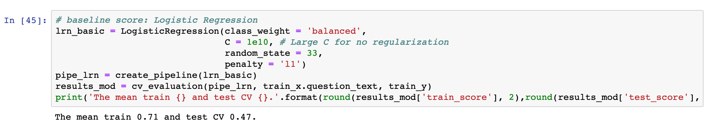

I used high `C`parameter in `LogisticRegression` because natively this algorithm implements regularization. Regularization is a method that constrains or shrinks the coefficient estimates towards zero. In other words, this technique discourages learning a more complex or flexible model, so as to avoid the risk of overfitting. A high `C` parameter discourages regularization. 

The CV score for train and test are significantly different from each other, which implies strong overfitting. This is more evident when we observe the learning curve on **Figure 10**:

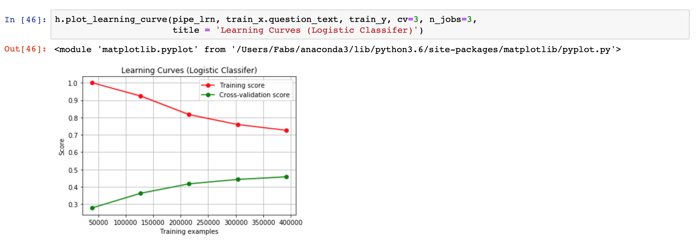

There is also a leaderboard that orders each of the competition participants by their public test set performance [15]. This will also be consulted for comparison.

# III. Methodology

In the **Figure 11** I detail the strategy that I used to tackle this classification problem. The idea behind the strategy is to feed the last prediction with a multitude of information. On one hand, you have the text features obtain through the bag of words model. This generates a vast document-term matrix, which can be directly use for classification. Nevertheless, its extremely sparse and models have a hard time finding patterns. After applying TFIDF statistic, there is a need to reduce the dimensionality of this matrix for performance and time efficiency. Two ways of achieving this, and at the same time improving the data, is by feature selection, and by using a classifier's prediction as a feature for another model. This is very similar to stacking. The idea behind it is to provide the next model with an already process view of the data. On the meta feature side, I will extract document and sentiment level features as describe before. I hope that with this strategy the final model will be able to grasp more patterns when combining the process text features with the meta features of the questions. 

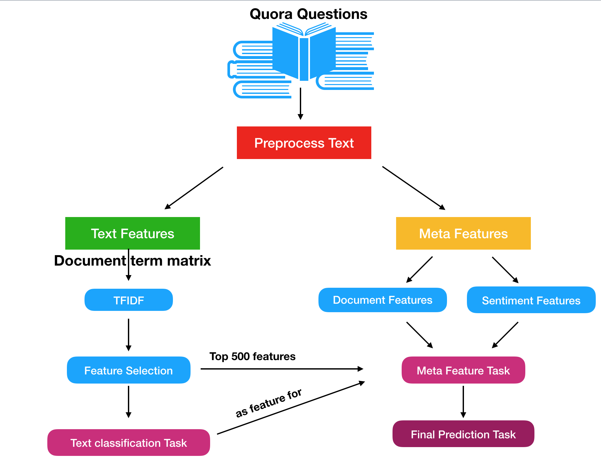

## Data Preprocessing and Implementation

The data was intensively processed in our task. I divided this phase into three parts:

1. **Text cleaning process**: The main objective of this part is to apply a series of transformations to the text data know as text preprocessing techniques. These techniques have been shown to improve, standarise and facilitate modelling. The techniques are de following:

    - Lower casing: Standarise text data. Python, for example, finds that `Hello` and `hello` are to different strings. 
    - Punctuation removal: Standarise text data. Punctuation marks is a human readible code that helps us give rhtyms and intonation to our reading. For our task and strategy, most of it is noise. 
    - Special character removal: Standarise text data. Mainly accents and non latin characters. 
    - Lemmatization: Standarise text data. A word may be express in multiple tense depending on the context. So lemmatization is the process of grouping together the inflected forms of a word so they can be analysed as a single item. 
    - Stopwords removal. Noise reduction. Many words serve as connectors in a sentence. They are the most common and frequent words in any language, thus they are usually not informative and are filtered out the analysis. 

Most of them are standard transformations and have become canonical in most text classificaction tasks. This proyect implemented a function called `clean_text` that applies all the transformations above and generated two columns: `qt_clean` a clean standarise text vector with stopwords and `qt_clean_stop` a clean standarise text vector without stopwords. This custom made function is strongly supported by the `NLTK`package. 

2. **Feature Extraction**: This is the most intensive part of this project. The main objective is to extract all the posible and informative features from the text for later modelling. A poor feature pool yields a poor classification model, thus my strategy will be:

+ Meta document features: These are all features related to the document statistics. They by itself are not strong predictors but in combination they can help the model gain more insight of the text. These are number of characters, number of words, word density, number of stopwords, number of punctuation marks, number of upper case words, number of nouns, verb, adjectives, pronouns, and adverbs. This last 5 features where implemented in 5 new function, which is supported on the `TextBlob`package. Each question was brokendown into words and each word was tag with a part-of-speach recognition algorithm. These were the most time consuming functions of the project. Therefore, I parallelized this task with the `concurrent.future` module [16]. 
    
+ Sentiment Features: Words in all language have an inherent sentiment behind it. Most of the time it depends on the context of what it is said. However, words like `Happiness` almost all of the time is positive. Many libraries exist today that are able to score a group of words and approximate a sentiment. So I made use of the powerful `TextBlob` package to extract polarity, subjectivity and positivity of the questions. The positivity was obtained by a NaiveBayes Classifier from this package that was previously traind on movie reviews. 
    
+ Text features: I will decompose each text into a document-term matrix, describes the frequency of terms that occur in a collection of documents. The matrix consist of (m x n) dimensions beign **m** the number of documents or questions and **n** the terms which are present in the documents. Since each documents consist of a small portion of the whole vocabulary of the set, most of the matrix is extremely sparse and noisy. This is even worse when considering not only words, but bigrams or trigrams of words, they aggregate information but also significantly increase the matrix dimension. To reduce noise, I normalized each term using Term Frequency (TF) Inverse Document Frequency (IDF) statistic which generally improves modelling performance as mention above. Moreover, I filtered-out high sparse terms and performed feature selection using chi-squared statistic. Several functions where created to achieve this task. I implemented small pipelines that allow to easily reproduce text vectorization (**Figure 12**).
    
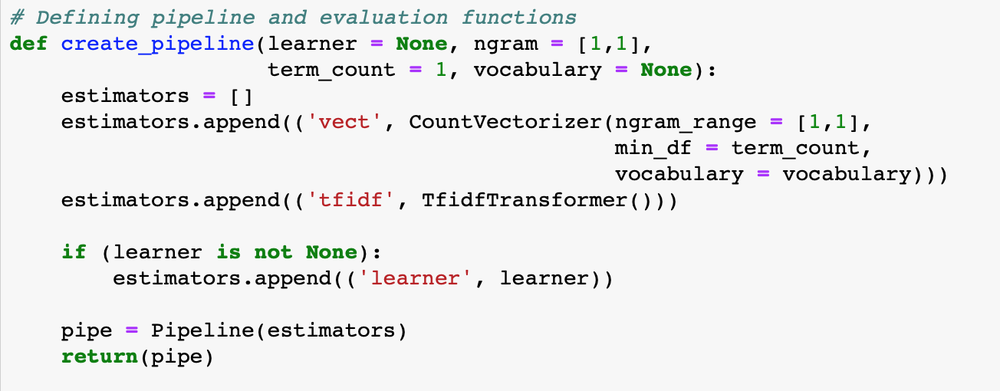

+ Predictive Text features: I selected the model that performed best with only the text features. This prediction became a feature that was used to stack with the metafeatures (meta document features + Sentiment Features). More details of its implementation in the next section.

3. **Modelling**. To extract the most out of the features I emsembled different models on different set of features. The prediction of the text features was pooled to a master classifier that produce the final classification task. As describe in algorithm section above, I use a mixture of the following classifiers:

+ Logistic Regression (regularize L2)
+ Naive Bayes
+ LightGBM (very similar to gradient boosting but faster)
+ Ensemble (from the 3 above) 
    
To be able to achieve reproducible results I first splitted the data in training, testing, and validation set. The testing set was never used until the end. I design 3 functions that help me achieve this task: `cv_evaluation`, which worked closely with the simple pipeline function. Internally it vectorize the text, and performe a 5-fold CV with the text features. This help me assess very rapidly if my classifier was overfitting or not (**Figure 13**). 

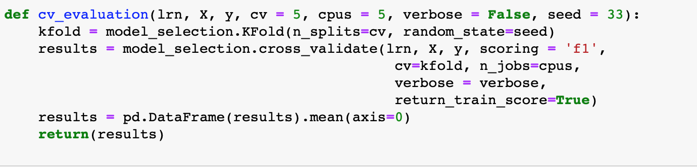

When evaluating multiple models I design the `testing_models` function. It allowed me to pass a dictionary of predefined classifiers, and internally the function looped through each model, fit_transformed training set and validation set, calculated the optimal threshold value by calling internally the `threshold_search` function. Finally, the best performing F1-score was calculated for training and validation set. it return, these results as well as the fitted model for further use. 

## Refinements

### Text Feature Extraction

I tested many types of preprocessing techniques at the begining. Although most of the time it did not improve CV performance it did reduce significantly overfitting. For example, the logistic benchmark showed a mean train score of 0.71 and test CV of 0.47, which implies overfitting. The processing step implemented in this work reduced the train score to 0.66 and barely reducing the CV test to 0.46. This is not esencially bad, it means that the model is less prune to learn from the noise. I did not achieve better results afterwards, thus I decided to keep this processing step. 

I studied the ngrams feature in the production of the DTM. Although this increase the terms from ~150.000 unigrams to ~4.3MM combination of unigrams, bigrams and trigrams, It generally improved my CV score, it the CV test from 0.46 to 0.49 on average. I decided to keep the ngrams feature up to trigrams. This nevertheless, obligated me to performe a dimensionality reduction step. All of this analysis you can find it in the `Quora_project_sandbox.py`. 

### Topic Modelling

I devoted a lotof time in topic modelling with LSA. I implemented several functions to optimize the process. I also continously refine the step with collocations (concept words) and coherence of topic analysis. However, the results where not reproducible, and in the timeframe that I manage I wasn't able to correctly implement and scale this feature. Particularly, I wasn't able to predict new topics on new documents. The efford necessary to solve this issue would have consume me priceless time in modelling. Consequently, I decided to remove this processing step and features. You can find part of its implementation on the `LSA_topic_modelling.py`. 

### Modelling

The final selection of classifiers was a balance of model knowlegde and time efficiency. I am usually inclined to use tree-based methods, however they did't performed well in my first tries. They usually got performance lower than 0.4, which was much lower than the linear baseline. I ended selecting naivebayes, because of its simplicity and speed, and lightGBM because of its speed and predictive power. Nevertheless, its greatness comes from the long list of adjustable parameters its has. I had previously work with this algorithm so I knew the range of some of its parameters. For example I never test more than `max_depth` > 6 because I had had terrible overfitting problems in the past. I did not perform any grid search or any type of systematic tuning, mainly because of time constrains. But I did experiment with some of the parameters. For example, I changed the `n_estimators` from 1000 to 500 when modelling from text tometa features. This was because, when facing an enormous amount of variables (text features), it needed a greater number of boosted trees to capture patterns. It improved both my training and CV scores from ~0.5 to 0.58-0.6 in text feature classification. 

# IV. Results

## Model Evaluation, Validation and Justification

The final model is supported greatly on the text feature prediction. Both models will be analyze. 

### Text feature Model

For this model I perform a feature selection using chi-squared statistic. I chose a very strict probability (*p = 0.001*) to find terms that are dependent of the target. This filtered out most of the words leaving around ~5000 features to train this model. Still it would be challenging. 

The model's results were analyze in terms of its F1-score and predicting times as mention in the refinements section. I previously tested `Extratrees` classifier but it took over 20 minutes to train and test, which hinder my ability to iterate fast. Also, on average trees model got below 0.5 on F1-Score. Thus, tree model where discarded. All of the models had a very similar performance, however, Naive Bayes was the one that scored the lowest. Logistic Classifier with regularization is the one that perform most consistently on the 3 scores (**Figure 14**). Its showed no overfitting, on the other hand, lightGBM's difference between train and testing scores indicate that it suffer slightly from overfitting. As expected the ensemble model was able to capture all of the models views and had the best score in the testing set (0.581), barely above lightGBM and regularize LogReg. Because of its reproducibility and robustness I decided to select the ensemble classifier for the text feature prediction. 

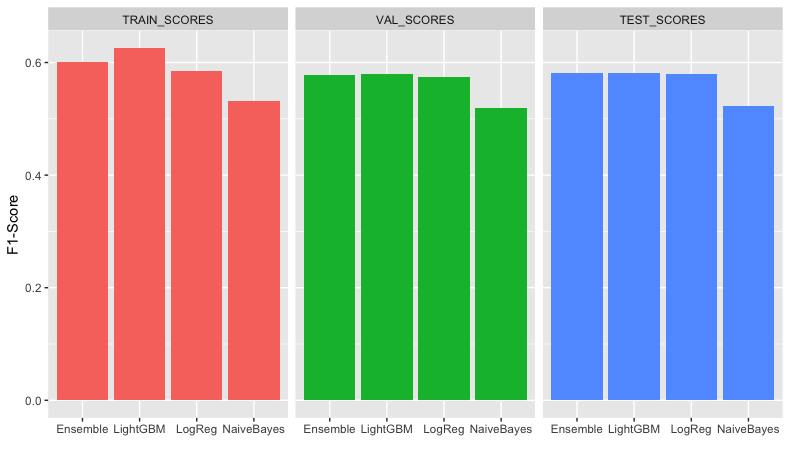

### Meta Feature Model
    
Same as the previous model, results were analyze in terms of its F1-Score. I did not test anymore classifiers for this task, and kept the same as before. This model showed a better performance on all the models, on average, compared to the text feature model (**Figure 15**). The results confirms my strategy as a way to improve the text classification scores, all of the scores improve, particularly the score of naive bayes model increase from 0.52 in the test set to 0.58 in the final model. Adicionally, the scores were very stable and reproducible. Similarly as the text feature model, lightGBM showed to suffer slightly from overfitting. The ensemble model was the highest score model 0.598 (test) and this is the final model I decide to use for meta feature classification. 

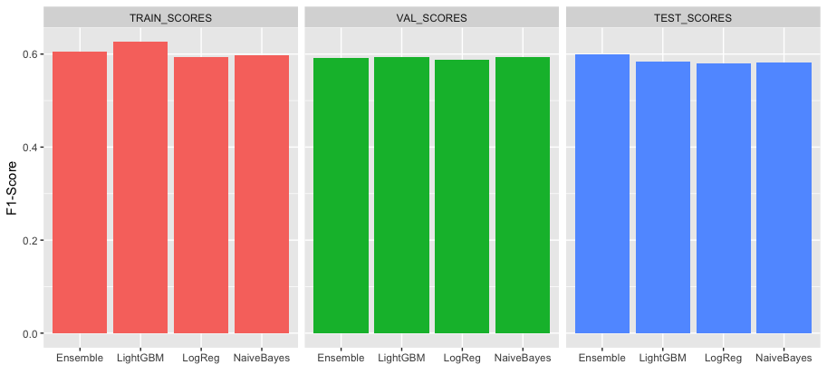

# V. Conclusion

A supervised learning model was developed in order to identify which question are consider sincere or insincere on Quora's plataform. The task was challenging, because the only source of features is the question text itself. As we can recall on **Figure 11** I proposed two way complementary strategy to extract features and model text data. All the work was supported by a central step of text preprocessing. In this step I tested and researched diferent ways of cleaning and standarizing text data. Multiple modules, packages and custom functions were constructed to achieve this goal efficiently. When comparing the performance between the crude text and the preprocess text with the basic linear benchmark, it showed almost negligible reduction on the validation set and a reduction in the training set. However, this reduction was beneficial because the model suffered strongly from overfitting. The preprocessing reduced this effect, which was exactly its main objective. Then I extracted word level ngram features from the question's text. This yielded an enormous document-term matrix. To reduce noise and improve modelling efficiency I performed chi-squared feature selectiong on this matrix. This resulted in a much smaller and more manageble matrix that was filled with statistically significant words with respect to the target. A first round of text classification was performed with this "text derived features". The models overall showed little overfitting, as expected from previous analysis. The performance between models where barely diferent, only Naive Bayes consistently underperforme in comparison with linear, lightGBM and ensembled model. The best performance was achieved by the ensemble model (0.5815964) with respect to the unseen data (test set). 
The results of this model was use as a predictor for a second round of classification task. The goal was to integrate the predicted class from text features with the new featires as a way to improve classification. This was exactly what the results show. Although the still room for improvemente, all models increase their performance with the new meta features. Particularly, the model most benefited by this strategy was Naive Bayes, its test set performance improve from 0.52 to 0.58. 

I found extremely exciting this project. Since this in an ongoing kaggle project, this project report will be converted into a kaggle kernel and I will continue to participate, hopefully improving my results. I'm very satisfy with the whole process, because besides participating on the kaggle project, I was my main interest to learn NLP done in python. Recently I have started a project at my job which involves NLP so this was a great chance to dive in, learn, and improve my machine learning skills. 

## Improvement

There is a lot to improve yet. I just tested a handfull of supervise models, however, deep learning models are one of the most recommended models to performe text classification. This is because, neural nets are able to capture dependencies and word context, whereas the bag of words considers each word independent. My efforts on this stage was to construct an scalable and easy to interpret model, which I think I achieved, But in a second round I am interested in learning more about deep learning and its capabilities in this field.  

Before I jump to deep learning I think there is still space to improve in obtaining better features for modelling. For example, although I experimented and couldn't implement topic modelling (yet), it has been shown that it can significantly improve NLP challenges. 

Another place were there room for improvementes is the word representations. Bag of words is just one model on how to represent words in space. Nevertheless, there has been importante advancements in word embeddings like word2vec. In fact, the competitions allows the use up to 4 word embeddings, which are provided with the data. These word embeddings that have been trained with millons of documents, capture context and liguistic intricacies that normal representations do not. 

I believe a better strategy can improve the actual outcome. For example, by stacking the predictions of multiple models, not just one. The final feature set could be transform, for example, by PCA to avoid multicollinearity when using linear models. 

## References

[1] Nobata, Chikashi & Tetreault, Joel & Thomas, Achint & Mehdad, Yashar & Chang, Yi. (2016). Abusive Language Detection in Online User Content. 145-153. 10.1145/2872427.2883062.

[2] https://medium.economist.com/help-us-shape-the-future-of-comments-on-economist-com-fa86eeafb0ce. Help us shape the future of comments on economist.com

[3] https://meta.wikimedia.org/wiki/Research:Detox. Research:Detox.

[4] https://www.nytco.com/press/the-times-is-partnering-with-jigsaw-to-expand-comment-capabilities/. The Times is Partnering with Jigsaw to Expand Comment Capabilities

[5] https://www.theguardian.com/technology/series/the-web-we-want. The web we want. 

[6] https://www.perspectiveapi.com/#/. Perspective API.

[7] https://en.wikipedia.org/wiki/Natural_language_processing. Natural Language Processing.

[8] https://www.kaggle.com/c/quora-insincere-questions-classification. Quora Insincere Questions Classification.

[9] https://scikit-learn.org/stable/modules/generated/sklearn.feature_selection.chi2.html. Scikit Learn Chi-squared statistic.

[10] https://scikit-learn.org/stable/modules/generated/sklearn.feature_selection.mutual_info_classif.html#sklearn.feature_selection.mutual_info_classif. Scikit Learn Mutual Information.

[11] https://www.kaggle.com/c/quora-insincere-questions-classification/data. General Description of Data.

[12] https://www.analyticsvidhya.com/blog/2018/04/a-comprehensive-guide-to-understand-and-implement-text-classification-in-python/. Comprehensive guide to implement text classification in python. 

[13] https://scikit-learn.org/stable/modules/ensemble.html#ensemble. Ensemble methods.

[14] https://lightgbm.readthedocs.io/en/latest/. LightGBM’s documentation.

[15] https://www.kaggle.com/c/quora-insincere-questions-classification/leaderboard. Leaderboard. 

[16] http://danshiebler.com/2016-09-14-parallel-progress-bar/. Parallel progress bar. 

