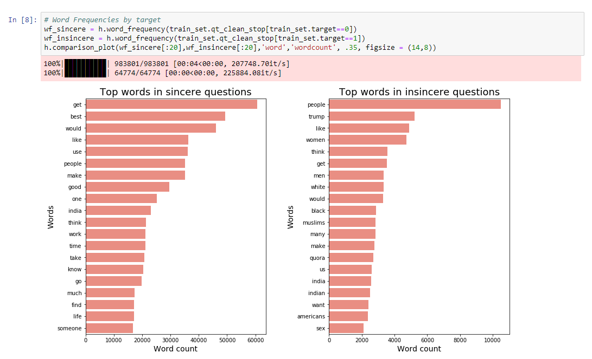
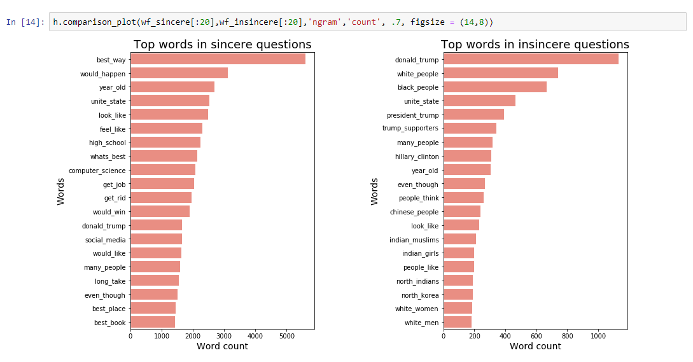
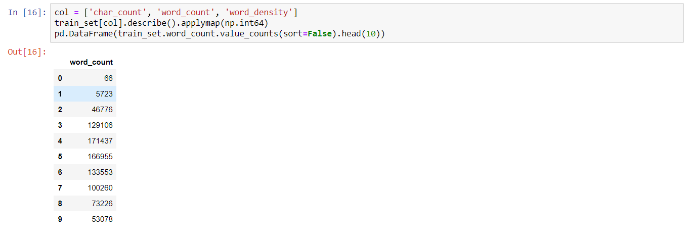
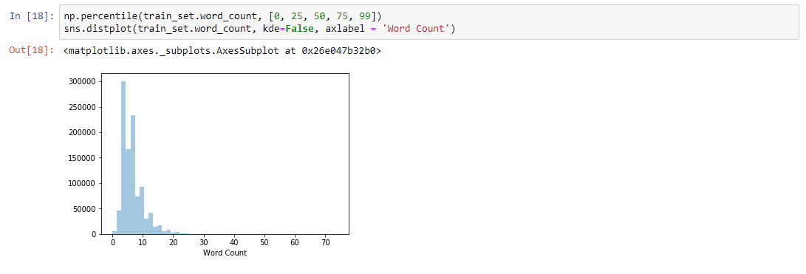
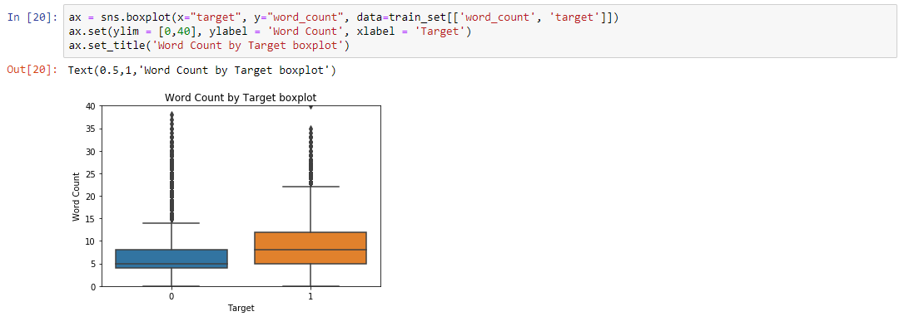

# I. Definition
## Project Overview

The digital transformation has completely changed our way of communicating between ourselves. Today most of our social relationships, work, and reading is done online. Although, online communication has been a great place for personal expression and insightful discussions, it has also been a place for toxic and divisive content. The threat of abuse and online harassment, which derives from this toxic content, has been a growing concern this past few years [1]. People who suffer from this divisive content usually stop expressing themselves and give up on seeking different opinions. On the long run, this can become an existential problem in freedom of speech. 

Many well-known social and news media platforms have tackled this issue with online moderators, however, the immense amount of content that every day is generated makes this task extremely hard and most of the time futile. Hence, many platforms have turn to machine learning to identify, evaluate and support online moderators on this critical task. This has become a reality for big media platforms such as The Economist [2], Wikipedia [3], New York Times [4], and The Guardian [5]. All of them have partnered with Google and Jigsaw to experiment with their new Perspective API that helps them host better online conversations [6]. 

This task is part of a subfield called Natural Language Processing (NLP), which is concerned with the interactions between computers and human languages, in particular how to program computers to process and analyze large amounts of natural language data [7]. This field has greatly grown these past few years and I hope that with this proyect I get introduce myself to this new subject, learn and in the long run contribute. 

## Problem Statement

Quora is a platform that empowers people to learn from each other, thus it’s been a frequent target for abusive content. Quora wants to keep their platform as a place where users can feel safe sharing their knowledge with the world, therefore it wants to face this problem by hosting a Kaggle competition aimed at **identifying** and **flagging** insincere questions [8].  By definition an insincere question is a question which is founded upon false premises, or that intend to make a statement rather than look for helpful answers. Quora wants kagglers to develop **scalable methods and models** that will help achieve this goal.

To achieve this goal I intend to break down the problem into 3 parts:

1. **Text cleaning process**: The main objective of this part is to apply a series of transformations to the text data know as text preprocessing techniques. These techniques have been shown to improve, standarise and facilitate modelling. The techniques are de following:

    - Lower casing: Standarise text data. Python, for example, finds that `Hello` and `hello` are to different strings. 
    - Punctuation removal: Standarise text data. Punctuation marks is a human readible code that helps us give rhtyms and intonation to our reading. For our task and strategy, most of it is noise. 
    - Special character removal: Standarise text data. Mainly accents and non latin characters. 
    - Lemmatization: Standarise text data. A word may be express in multiple tense depending on the context. So lemmatization is the process of grouping together the inflected forms of a word so they can be analysed as a single item. 
    - Stopwords removal. Noise reduction. Many words serve as connectors in a sentence. They are the most common and frequent words in any language, thus they are usually not informative and are filtered out the analysis. 

Most of them are standard transformations and have become canonical in most text classificaction tasks. This proyect implemented a function called `clean_text` that applies all the transformations above and generated two columns: `qt_clean` a clean standarise text vector with stopwords and `qt_clean_stop` a clean standarise text vector without stopwords. 

2. **Feature Extraction**: This is the most intensive part of this project. The main objective is to extract all the posible and informative features from the text for later modelling. A poor feature pool yields a poor classification model, thus my strategy will be:
    - Meta document features: These are all features related to the document statistics. They by itself are not strong predictors but in combination they can help the model gain more insight of the text. These are number of characters, number of words, word density, number of stopwords, number of punctuation marks, number of upper case words, number of nouns, verb, adjectives, pronouns, and adverbs. 
    - Sentiment Features: Words in all language have an inherent sentiment behind it. Most of the time it depends on the context of what it is said. However, words like `Happiness` almost all of the time is positive. Many libraries exist today that are able to score a group of words and approximate a sentiment. So I will make use of the powerfull `TextBlob` package to extract polarity, subjectivity and positivity of the questions. 
    - Text features: I will decompose each text into a document-term matrix, describes the frequency of terms that occur in a collection of documents. The matrix consist of (m x n) dimensions beign **m** the number of documents or questions and **n** the terms which are present in the documents. Since each documents consist of a small portion of the whole vocabulary of the set, most of the matrix is extremely sparse and noisy. This is even worse when considering not only words, but bigrams or trigrams of words. To reduce noise, I will normalize each term using Term Frequency (TF) Inverse Document Frequency (IDF) statistic which generally improves modelling performance. Moreover, I will filter-out high sparse terms and perform feature selection using chi-squared statistic. 
    - Topic features: I will reduce dimensionality and cluster documents by performing Latente Semantic Analysis. This technique analyzes relationships between a set of documents and the terms they contain by producing a set of concepts related to the documents and terms.

3. **Modelling**. To extract the most out of the features I will emsemble different models on different set of features and the predictions of this group of models will be pooled to a master classifier that will produce the classification task. I will use a mixture of the following classifiers:
    + Logistic Regression (base learner)
    + Naive Bayes
    + Extratrees (very similar to randomforest but faster)
    + AdaBoost 
    
I will support my modelling with learning curves and cross-validation (5-fold) methodology. 

## Metrics

As we will se in the exploratory section of this report, our data set is very unbalanced. Therefore, and as recommended in the kaggle competition, I will use de F1-score for model performance. This metrics considers both precision and recall, thus is very helpful in this case because we are dealing with an unbalanced dataset. The formula used to obtain this metric is:

$$\frac{2*precision*recall}{precision+recall}$$

For univariate feature evaluation I will look into **chi-squared statistic** between each non-negative feature and class. Chi-square test measures dependence between stochastic variables, so using this function it filters out features that are the most likely to be independent of class and therefore irrelevant for classification [9]. In case negative features emerge (metafeature extraction por example), I will use a information gain feature evaluation like **Mutual information** implementation of scikit learn. Mutual information (MI) between two random variables is a non-negative value, which measures the dependency between the variables. It is equal to zero if and only if two random variables are independent, and higher values mean higher dependency [10].

# II. Analysis
## Exploratory Data Analysis

In this section I will go in deep in understanding the data, showing basic statistics and visualizations. First, lets see a sample of the data:

The dataset considered for this project can be found and downloaded from the competition site [11]. **The data set has a total of 1048575 rows and 3 columns**. The description of each column is as folliwing:

- qid: unique question identifier
- question_text: Quora question text
- target: a question labeled "insincere" has a value of 1, otherwise 0

The criteria’s to define an insincere question was based on the following characteristics:

* Has a non-neutral tone: exaggerated tone or rhetorical tone meant to make a statement about a group of people.
* Is disparaging or inflammatory: making discriminatory and/or harsh comments, or based on outlandish premise about a group of people.
* Isn't grounded in reality: based of false information or absurd assumptions. 
* Uses sexual content for shock value, and not to seek genuine answers

As expected from this type of labeling, the ground-truth are not guaranteed to be perfect but suficient for the problem.

As plotted above the data set is very unbalance. Therefore, I will take measures to reduce this problem during modelling (many models include a `class_weight = 'balanced` parameter to assign more weight to the lower class), and splitting data (`stratify` parameter).

### Word level Statistics

We will look into unigram and bigram frequency by target to find clues about the data.

A fast view of the most frequent unigrams show that sincere questions have usual words related to **asking verbs** and overall neutral words. However, insincere unigrams have more **sensitive nouns** like `indian`, `american`, `trump`, etc. 

Bigrams allow us a better understanding of what are the main ideas behind sincere and insincere questions. Its posible to see that many questions are related to find the `best` of place, book, way to do something. On the other hand, insincere questions focus **racial or gender or ethnic** group words. 

### Document level Statistics

We will now create basic meta document features to find **outliers**. These will be `word_count`, `character_count`,
`word_density`. A quick view of `word_count` of cleaned standarise text vector without stopwords (`qt_clean_stop`) shows the following frequency:

There are **66 documents** with zero words and **5723** questions with 1 non-stopword word. These documents show barely any relevant content, thus they will be remove from training set.

On the other hand, the histogram also shows that there are documents with more that **14 words (95% percentile)**, these are outliers and will be remove from training. Applying these filter reduces our data set by **10% (952400 rows)**.

When taking a closer look at this variable separated by target, it seems that insincere questions tend to be more elaborate than sincere. On average there are **9 words** per insincere questions instead of **6 words** per sincere question. This phenomena, is also observe when analyzing `character_count`, but `word_density` is practically the same between both classes. 

## Algorithms and Techniques

The main algorithms are separated into two main groups:

### Feature extraction algorithms

    - **Bag of Words Model**: all text feature extraction will be done using this model. is represented as the bag (multiset) of its words, disregarding grammar and even word order but keeping multiplicity. However, although is a very simplistic representation, it has shown to be very usefull in a wide variety of natural language processing tasks. Python has two powerful NLP modules that implement this model, the `NLTK` and `gensim` modules. Both are going to be use for feature extraction. 
    - **TF-IDF statistic**: TF-IDF score represents the relative importance of a term in the document and the entire corpus. TF-IDF score is composed by two terms: the first computes the normalized Term Frequency (TF), the second term is the Inverse Document Frequency (IDF), computed as the logarithm of the number of the documents in the corpus divided by the number of documents where the specific term appears [12]. This statistic normalization will be apply to all the text feature analysis. 

### Classification algorithms
    
This is a binary classification task. Hence, the models that will be tested with pros and cons are:

    - **Linear Models**: The main algorithm will be the logistic classifier implemented as `LogisticRegression()` in sci-kit learn. this algorithm is usually the *go-to* benchmark. Its usually very fast and scales excellent with data. If the data preprocessing is adequate, the performance is usual very decent. However, since its linear, it fails to grasp non-linearities in the data and many times underperforming in complex datasets. Also it suffers from multicollinearity. 
    - **Naive Bayes**: Is a family of simple "probabilistic classifiers" based on applying Bayes' theorem with strong (naive) independence assumptions between the features. Naive Bayes classifiers are highly scalable, requiring a number of parameters linear in the number of variables (features/predictors) in a learning problem. Nevertheless, as with linear models, naive bayes suffers to grasp non-linearities in the data. Despite their naive design and apparently oversimplified assumptions, naive Bayes classifiers have worked quite well in many complex real-world situations, particularly in NLP tasks. For this project I will implement the `ComplementNB()`, this variant was designed to correct the “severe assumptions” made by the standard Multinomial Naive Bayes classifier. It is particularly suited for imbalanced data sets.
    - **ExtraTrees**: In extremely randomized trees (`ExtraTreesClassifier()`), randomness goes one step further in the way splits are computed in comparison to standard random forest classifier. As in random forests, a random subset of candidate features is used, but instead of looking for the most discriminative thresholds, thresholds are drawn at random for each candidate feature and the best of these randomly-generated thresholds is picked as the splitting rule. This usually allows to reduce the variance of the model a bit more, at the expense of a slightly greater increase in bias. 
    - **Adaboost**: Is one of the most popular and one of the first boosting algorithms. Its very easy to implement when using simple weak learners (i.e decision tree), its has a build in feature selection mechanism that results in a relatively simple classifier, and generalize well because of the use of multiple weak learners.  Its main drawback is that, because it tries to fit all data points, it is sensible to outliers and noisy data. In our dataset, I have a large data set with over a hundred text features so its likely that any model we choose is prune to overfit. Adaboost adapts to data learning from its mistakes and, as describe before, is generally tolerant to overfitting. Thus is a good candidate for the task. Sci-kit learns implements this classifier as `AdaBoostClassifier()`.

## References

[1] Nobata, Chikashi & Tetreault, Joel & Thomas, Achint & Mehdad, Yashar & Chang, Yi. (2016). Abusive Language Detection in Online User Content. 145-153. 10.1145/2872427.2883062.

[2] https://medium.economist.com/help-us-shape-the-future-of-comments-on-economist-com-fa86eeafb0ce. Help us shape the future of comments on economist.com

[3] https://meta.wikimedia.org/wiki/Research:Detox. Research:Detox.

[4] https://www.nytco.com/press/the-times-is-partnering-with-jigsaw-to-expand-comment-capabilities/. The Times is Partnering with Jigsaw to Expand Comment Capabilities

[5] https://www.theguardian.com/technology/series/the-web-we-want. The web we want. 

[6] https://www.perspectiveapi.com/#/. Perspective API.

[7] https://en.wikipedia.org/wiki/Natural_language_processing. Natural Language Processing.

[8] https://www.kaggle.com/c/quora-insincere-questions-classification. Quora Insincere Questions Classification.

[9] https://scikit-learn.org/stable/modules/generated/sklearn.feature_selection.chi2.html. Scikit Learn Chi-squared statistic.

[10] https://scikit-learn.org/stable/modules/generated/sklearn.feature_selection.mutual_info_classif.html#sklearn.feature_selection.mutual_info_classif. Scikit Learn Mutual Information.

[11] https://www.kaggle.com/c/quora-insincere-questions-classification/data. General Description of Data.

[12] https://www.analyticsvidhya.com/blog/2018/04/a-comprehensive-guide-to-understand-and-implement-text-classification-in-python/. Comprehensive guide to implement text classification in python. 

[13] https://scikit-learn.org/stable/modules/ensemble.html#ensemble. Ensemble methods.
